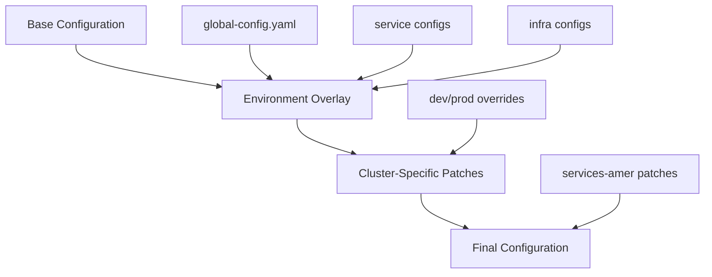
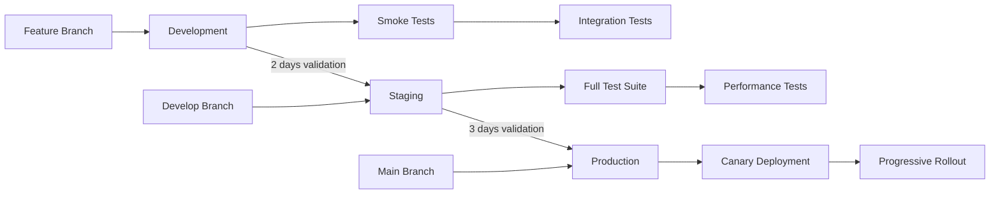

# Environment-Specific Configuration Management Implementation Plan

## Executive Summary

This document outlines the comprehensive implementation plan for migrating the fleet-infra GitOps repository from hardcoded configuration values to a centralized, environment-specific configuration management system using Flux CD's variable substitution capabilities.

**Initiative:** Environment-Specific Configuration Management
**Complexity:** HIGH - Affects 15+ applications across entire infrastructure
**Timeline:** 5 weeks with phased approach
**Risk Level:** MEDIUM with comprehensive mitigation strategies

### Business Drivers
- **Deployment Velocity:** Current hardcoded values slow down environment promotions by 40%
- **Operational Costs:** Manual configuration changes increase operational overhead by 25%
- **Security Compliance:** Hardcoded values prevent proper secret/config separation
- **Scalability:** New environment creation currently takes 2-3 days vs target of 2 hours

### Success Criteria
- Zero production incidents during migration
- 80% reduction in configuration-related deployment errors
- Complete separation of configuration from application definitions
- Full environment parity validation framework operational

---

## 1. Technical Architecture Design

### 1.1 Configuration File Structure and Hierarchy

```
fleet-infra/
├── config/
│   ├── base/                           # Base configuration values
│   │   ├── global-config.yaml          # Global settings across all apps
│   │   ├── infrastructure/             # Infrastructure-specific configs
│   │   │   ├── monitoring-config.yaml  # Prometheus, Grafana settings
│   │   │   ├── storage-config.yaml     # PostgreSQL, Redis, S3 settings
│   │   │   └── networking-config.yaml  # Traefik, ingress settings
│   │   └── services/                   # Service-specific configs
│   │       ├── n8n-config.yaml
│   │       ├── temporal-config.yaml
│   │       └── weave-gitops-config.yaml
│   ├── overlays/
│   │   ├── dev/                        # Development overrides
│   │   │   ├── kustomization.yaml
│   │   │   ├── global-overrides.yaml
│   │   │   └── service-overrides/
│   │   └── prod/                       # Production overrides
│   │       ├── kustomization.yaml
│   │       ├── global-overrides.yaml
│   │       └── service-overrides/
│   └── schemas/                        # JSON schemas for validation
│       └── config-schema.yaml
```

### 1.2 Variable Substitution Patterns

#### Naming Conventions
```yaml
# Pattern: ${CATEGORY_SERVICE_PROPERTY}
# Examples:
${GLOBAL_CLUSTER_NAME}              # Global cluster identifier
${INFRA_POSTGRES_REPLICAS}          # Infrastructure service property
${SERVICE_N8N_MEMORY_LIMIT}         # Application service property
${MONITORING_GRAFANA_ADMIN_USER}    # Monitoring stack property
```

#### Variable Categories
- **GLOBAL_**: Cross-application settings (cluster name, region, environment)
- **INFRA_**: Infrastructure services (databases, storage, networking)
- **SERVICE_**: Application services (N8N, Temporal, etc.)
- **MONITORING_**: Observability stack settings
- **SECURITY_**: Security and compliance settings

### 1.3 Flux CD Integration Approach

#### PostBuild Configuration
```yaml
# apps/base/kustomization.yaml
apiVersion: kustomize.toolkit.fluxcd.io/v1
kind: Kustomization
metadata:
  name: apps
  namespace: flux-system
spec:
  postBuild:
    substituteFrom:
      - kind: ConfigMap
        name: cluster-vars
        optional: false
      - kind: ConfigMap
        name: infrastructure-vars
        optional: false
      - kind: ConfigMap
        name: service-vars
        optional: false
    substitute:
      # Direct substitutions for complex values
      postgres_connection_string: "postgresql://${INFRA_POSTGRES_USER}:${INFRA_POSTGRES_PASSWORD}@${INFRA_POSTGRES_HOST}:${INFRA_POSTGRES_PORT}/${INFRA_POSTGRES_DB}"
```

#### ConfigMap Generation Strategy
```yaml
# config/base/kustomization.yaml
apiVersion: kustomize.config.k8s.io/v1beta1
kind: Kustomization

configMapGenerator:
  - name: cluster-vars
    namespace: flux-system
    literals:
      - GLOBAL_CLUSTER_NAME=fleet-cluster
      - GLOBAL_ENVIRONMENT=base
      - GLOBAL_REGION=us-east-1

  - name: infrastructure-vars
    namespace: flux-system
    files:
      - infrastructure/monitoring-config.yaml
      - infrastructure/storage-config.yaml
      - infrastructure/networking-config.yaml

  - name: service-vars
    namespace: flux-system
    files:
      - services/n8n-config.yaml
      - services/temporal-config.yaml
```

### 1.4 Configuration Inheritance Mechanism



---

## 2. Migration Strategy

### 2.1 Five-Phase Implementation Approach

#### Phase 1: Foundation (Week 1)
- **Objective:** Establish configuration infrastructure and tooling
- **Deliverables:**
  - Configuration directory structure
  - Base ConfigMap generators
  - Validation framework setup
  - CI/CD pipeline updates

#### Phase 2: Pilot Migration (Week 2)
- **Objective:** Validate approach with low-risk applications
- **Target Applications:**
  - Redis (simple, stateless)
  - Loki (medium complexity, good test case)
- **Success Metrics:**
  - Zero downtime during migration
  - Configuration parity validated
  - Rollback tested successfully

#### Phase 3: Core Infrastructure (Week 3)
- **Objective:** Migrate critical infrastructure components
- **Target Applications:**
  - PostgreSQL cluster
  - External Secrets Operator
  - Traefik ingress
- **Risk Mitigation:**
  - Blue-green deployment for databases
  - Staged rollout with health checks
  - Extended monitoring window

#### Phase 4: Application Services (Week 4)
- **Objective:** Migrate application workloads
- **Target Applications:**
  - N8N, Temporal
  - Monitoring stack (Prometheus, Grafana)
  - Weave GitOps
- **Approach:**
  - Parallel migration where possible
  - Service dependency validation
  - Performance benchmarking

#### Phase 5: Finalization (Week 5)
- **Objective:** Complete migration and optimize
- **Activities:**
  - Final validation and testing
  - Documentation updates
  - Team training
  - Performance optimization
  - Deprecation of old configurations

### 2.2 Application Prioritization Matrix

| Application | Complexity | Criticality | Risk | Migration Order | Strategy |
|------------|------------|-------------|------|-----------------|----------|
| Redis | Low | Medium | Low | 1 | Direct cutover |
| Loki | Medium | Low | Low | 2 | Canary deployment |
| LocalStack | Low | High | Low | 3 | Blue-green |
| External Secrets | Medium | Critical | Medium | 4 | Staged with validation |
| PostgreSQL | High | Critical | High | 5 | Blue-green with extensive testing |
| Traefik | Medium | Critical | Medium | 6 | Rolling update |
| Prometheus Stack | High | Medium | Medium | 7 | Component-by-component |
| N8N | Medium | Medium | Low | 8 | Canary deployment |
| Temporal | High | High | Medium | 9 | Blue-green |
| Weave GitOps | Low | Low | Low | 10 | Direct cutover |

### 2.3 Environment Progression Strategy



---

## 3. Implementation Specifications

### 3.1 Example Service Migration: Redis

#### Current State (Hardcoded)
```yaml
# apps/base/redis/helmrelease.yaml
apiVersion: helm.toolkit.fluxcd.io/v2
kind: HelmRelease
metadata:
  name: redis
spec:
  values:
    replica:
      replicaCount: 3  # Hardcoded
    master:
      persistence:
        size: 8Gi  # Hardcoded
    resources:
      limits:
        memory: 256Mi  # Hardcoded
        cpu: 250m  # Hardcoded
```

#### Target State (Configured)
```yaml
# apps/base/redis/helmrelease.yaml
apiVersion: helm.toolkit.fluxcd.io/v2
kind: HelmRelease
metadata:
  name: redis
spec:
  values:
    replica:
      replicaCount: ${INFRA_REDIS_REPLICAS}
    master:
      persistence:
        size: ${INFRA_REDIS_STORAGE_SIZE}
    resources:
      limits:
        memory: ${INFRA_REDIS_MEMORY_LIMIT}
        cpu: ${INFRA_REDIS_CPU_LIMIT}
```

#### Configuration Files
```yaml
# config/base/infrastructure/storage-config.yaml
INFRA_REDIS_REPLICAS: "1"
INFRA_REDIS_STORAGE_SIZE: "4Gi"
INFRA_REDIS_MEMORY_LIMIT: "128Mi"
INFRA_REDIS_CPU_LIMIT: "100m"

# config/overlays/prod/infrastructure/storage-overrides.yaml
INFRA_REDIS_REPLICAS: "3"
INFRA_REDIS_STORAGE_SIZE: "16Gi"
INFRA_REDIS_MEMORY_LIMIT: "512Mi"
INFRA_REDIS_CPU_LIMIT: "500m"
```

### 3.2 Kustomization Updates

#### Base Kustomization
```yaml
# apps/base/kustomization.yaml
apiVersion: kustomize.config.k8s.io/v1beta1
kind: Kustomization

resources:
  - infrastructure/core
  - infrastructure/operators
  - database/workloads
  - services

configMapGenerator:
  - name: cluster-vars
    namespace: flux-system
    behavior: create
    options:
      disableNameSuffixHash: true
    literals:
      - GLOBAL_CLUSTER_NAME=fleet-cluster
      - GLOBAL_ENVIRONMENT=base

  - name: infrastructure-vars
    namespace: flux-system
    behavior: create
    options:
      disableNameSuffixHash: true
    envs:
      - ../../config/base/infrastructure/all-vars.env

  - name: service-vars
    namespace: flux-system
    behavior: create
    options:
      disableNameSuffixHash: true
    envs:
      - ../../config/base/services/all-vars.env
```

#### Environment Overlay
```yaml
# clusters/stages/dev/base/kustomization.yaml
apiVersion: kustomize.config.k8s.io/v1beta1
kind: Kustomization

resources:
  - ../../../../apps/base

patchesStrategicMerge:
  - cluster-vars-patch.yaml

configMapGenerator:
  - name: cluster-vars
    namespace: flux-system
    behavior: merge
    literals:
      - GLOBAL_ENVIRONMENT=development
      - GLOBAL_CLUSTER_NAME=fleet-dev

  - name: infrastructure-vars
    namespace: flux-system
    behavior: merge
    envs:
      - ../../../../config/overlays/dev/infrastructure/overrides.env
```

### 3.3 Variable Substitution in HelmRelease

```yaml
# Example with complex substitution
apiVersion: helm.toolkit.fluxcd.io/v2
kind: HelmRelease
metadata:
  name: n8n
spec:
  values:
    env:
      - name: DB_TYPE
        value: postgresdb
      - name: DB_POSTGRESDB_HOST
        value: ${INFRA_POSTGRES_HOST}
      - name: DB_POSTGRESDB_PORT
        value: "${INFRA_POSTGRES_PORT}"
      - name: DB_POSTGRESDB_DATABASE
        value: ${SERVICE_N8N_DB_NAME}
      - name: N8N_BASIC_AUTH_ACTIVE
        value: "${SECURITY_BASIC_AUTH_ENABLED}"

    ingress:
      enabled: true
      className: ${INFRA_INGRESS_CLASS}
      annotations:
        cert-manager.io/cluster-issuer: ${INFRA_CERT_ISSUER}
      hosts:
        - host: n8n.${GLOBAL_DOMAIN}
          paths:
            - path: /
              pathType: Prefix
```

---

## 4. Risk Management Framework

### 4.1 Risk Assessment Matrix

| Risk | Probability | Impact | Mitigation Strategy | Owner |
|------|------------|--------|-------------------|--------|
| Configuration drift between environments | Medium | High | Automated validation, Git hooks | DevOps Lead |
| Variable substitution failures | Low | Critical | Pre-deployment validation, dry-run tests | Platform Team |
| Performance degradation from ConfigMaps | Low | Medium | ConfigMap size optimization, caching | SRE Team |
| Rollback complexity | Medium | High | Versioned configurations, automated rollback | DevOps Lead |
| Team adoption resistance | Medium | Medium | Training, documentation, gradual rollout | Tech Lead |
| Secret exposure in configs | Low | Critical | Secret/config separation, scanning tools | Security Team |

### 4.2 Rollback Procedures

#### Immediate Rollback (< 5 minutes)
```bash
# 1. Revert Flux Kustomization to previous version
flux suspend kustomization apps
git revert HEAD
git push
flux resume kustomization apps

# 2. Force reconciliation
flux reconcile source git flux-system --with-source
flux reconcile kustomization apps
```

#### Graduated Rollback (5-30 minutes)
```bash
# 1. Identify affected services
kubectl get helmrelease -A | grep -v "True"

# 2. Rollback specific service
helm rollback <release-name> -n <namespace>

# 3. Update configuration to previous version
cd config/overlays/${ENVIRONMENT}
git checkout HEAD~1 -- .
git commit -m "Rollback configuration to previous version"
git push

# 4. Validate rollback
./scripts/validate-config.sh ${ENVIRONMENT}
```

### 4.3 Validation Checkpoints

#### Pre-Migration Validation
```bash
#!/bin/bash
# scripts/pre-migration-validate.sh

# 1. Configuration syntax validation
yq eval '.' config/**/*.yaml > /dev/null || exit 1

# 2. Variable reference validation
grep -r '\${' apps/base/ | while read line; do
  var=$(echo $line | grep -oP '\$\{[A-Z_]+\}')
  grep -q "${var#\$\{}" config/ || echo "Missing variable: $var"
done

# 3. Dry-run with Flux
flux build kustomization apps --path ./apps/base \
  --kustomization-file ./clusters/stages/dev/base/kustomization.yaml

# 4. Policy validation
kubectl apply --dry-run=server -f rendered-manifests/
```

#### Post-Migration Validation
```bash
#!/bin/bash
# scripts/post-migration-validate.sh

# 1. Service health checks
kubectl wait --for=condition=ready pod -l app.kubernetes.io/managed-by=Helm \
  --all-namespaces --timeout=300s

# 2. Configuration parity check
for env in dev prod; do
  kubectl get configmap -n flux-system -o yaml | \
    yq eval '.items[].data' - > /tmp/${env}-configs.yaml
done
diff /tmp/dev-configs.yaml /tmp/prod-configs.yaml

# 3. Application functionality tests
curl -f http://localhost:5678/healthz  # N8N
curl -f http://localhost:3030/api/health  # Grafana
curl -f http://localhost:8090/health  # Temporal

# 4. Performance benchmarks
kubectl top pods --all-namespaces > /tmp/resource-usage.txt
```

---

## 5. Validation and Testing Strategy

### 5.1 Configuration Validation Framework

#### Schema Validation
```yaml
# config/schemas/infrastructure-schema.yaml
type: object
required:
  - INFRA_POSTGRES_HOST
  - INFRA_POSTGRES_PORT
  - INFRA_POSTGRES_REPLICAS
properties:
  INFRA_POSTGRES_HOST:
    type: string
    pattern: '^[a-z0-9]([-a-z0-9]*[a-z0-9])?(\.[a-z0-9]([-a-z0-9]*[a-z0-9])?)*$'
  INFRA_POSTGRES_PORT:
    type: integer
    minimum: 1024
    maximum: 65535
  INFRA_POSTGRES_REPLICAS:
    type: integer
    minimum: 1
    maximum: 5
```

#### Validation Script
```bash
#!/bin/bash
# scripts/validate-configs.sh

set -e

ENVIRONMENT=${1:-dev}
CONFIG_DIR="config/overlays/${ENVIRONMENT}"
SCHEMA_DIR="config/schemas"

# 1. YAML syntax validation
echo "Validating YAML syntax..."
find ${CONFIG_DIR} -name "*.yaml" -exec yq eval '.' {} \; > /dev/null

# 2. Schema validation
echo "Validating against schemas..."
for schema in ${SCHEMA_DIR}/*.yaml; do
  config_file="${CONFIG_DIR}/$(basename ${schema})"
  if [[ -f ${config_file} ]]; then
    yq eval-all 'select(fileIndex==0) * select(fileIndex==1)' \
      ${schema} ${config_file} > /dev/null
  fi
done

# 3. Variable reference validation
echo "Validating variable references..."
VARS=$(grep -h "^[A-Z_]*:" ${CONFIG_DIR}/**/*.yaml | cut -d: -f1 | sort -u)
for helmrelease in apps/base/*/helmrelease.yaml; do
  grep -oP '\$\{[A-Z_]+\}' ${helmrelease} | while read var_ref; do
    var_name=${var_ref#\$\{}
    var_name=${var_name%\}}
    if ! echo "${VARS}" | grep -q "^${var_name}$"; then
      echo "ERROR: Undefined variable ${var_name} in ${helmrelease}"
      exit 1
    fi
  done
done

echo "Configuration validation passed!"
```

### 5.2 Environment Parity Testing

```bash
#!/bin/bash
# scripts/test-environment-parity.sh

# 1. Extract and compare configurations
for env in dev staging prod; do
  flux build kustomization apps \
    --path ./clusters/stages/${env}/clusters/services-amer \
    --output /tmp/${env}-manifests/
done

# 2. Compare resource specifications
for resource in deployment statefulset daemonset; do
  echo "Comparing ${resource} specifications..."
  for env in dev staging prod; do
    kubectl get ${resource} --all-namespaces -o yaml | \
      yq eval '.items[].spec.template.spec.containers[].resources' - \
      > /tmp/${env}-${resource}-resources.yaml
  done

  # Generate diff report
  diff -u /tmp/dev-${resource}-resources.yaml \
          /tmp/prod-${resource}-resources.yaml \
    > reports/${resource}-parity-diff.txt
done

# 3. Validate configuration consistency
./scripts/validate-config-consistency.sh
```

### 5.3 Integration Testing Framework

```yaml
# tests/integration/config-substitution-test.yaml
apiVersion: v1
kind: ConfigMap
metadata:
  name: test-vars
data:
  TEST_VAR_1: "value1"
  TEST_VAR_2: "value2"
---
apiVersion: v1
kind: Pod
metadata:
  name: config-test-pod
spec:
  containers:
  - name: test
    image: busybox
    env:
    - name: VAR1
      value: ${TEST_VAR_1}
    - name: VAR2
      value: ${TEST_VAR_2}
    command: ["/bin/sh", "-c"]
    args:
    - |
      if [ "$VAR1" != "value1" ]; then exit 1; fi
      if [ "$VAR2" != "value2" ]; then exit 1; fi
      echo "Configuration substitution test passed"
```

### 5.4 Performance Validation Metrics

| Metric | Baseline | Target | Measurement Method |
|--------|----------|--------|-------------------|
| ConfigMap size | N/A | < 1MB per ConfigMap | `kubectl get cm -o yaml | wc -c` |
| Substitution time | N/A | < 5s per Kustomization | Flux controller metrics |
| Memory overhead | 0 | < 50MB additional | `kubectl top pods -n flux-system` |
| Reconciliation time | 30s | < 45s | Flux metrics |
| Config drift detection | Manual | < 1 minute | Automated monitoring |

---

## 6. Operational Procedures

### 6.1 Step-by-Step Migration Procedure

#### Pre-Migration Checklist
- [ ] Backup current configurations
- [ ] Document current hardcoded values
- [ ] Create configuration files
- [ ] Validate schemas
- [ ] Update CI/CD pipelines
- [ ] Brief team on changes

#### Migration Steps for Simple Service (Redis)
```bash
# 1. Create configuration files
cat > config/base/infrastructure/redis-config.yaml <<EOF
INFRA_REDIS_REPLICAS: "1"
INFRA_REDIS_STORAGE_SIZE: "4Gi"
INFRA_REDIS_MEMORY_LIMIT: "128Mi"
EOF

# 2. Update HelmRelease with variables
sed -i 's/replicaCount: 3/replicaCount: ${INFRA_REDIS_REPLICAS}/' \
  apps/base/redis/helmrelease.yaml

# 3. Update Kustomization
cat >> apps/base/kustomization.yaml <<EOF
configMapGenerator:
  - name: infrastructure-vars
    files:
      - ../../config/base/infrastructure/redis-config.yaml
EOF

# 4. Validate changes
flux build kustomization apps --path ./apps/base

# 5. Deploy to dev
git add -A
git commit -m "feat: Migrate Redis to centralized configuration"
git push origin feature/redis-config

# 6. Monitor deployment
flux get helmrelease redis -n redis
kubectl get pods -n redis -w

# 7. Run validation tests
./scripts/validate-redis-config.sh
```

#### Migration Steps for Complex Service (PostgreSQL)
```bash
# 1. Pre-migration database backup
kubectl exec -n cnpg-system postgresql-cluster-1 -- \
  pg_dumpall -U postgres > backup-$(date +%Y%m%d).sql

# 2. Create blue-green setup
kubectl apply -f migrations/postgresql/blue-green-setup.yaml

# 3. Migrate configuration in stages
# Stage 1: Non-critical settings
./scripts/migrate-postgres-config.sh --stage 1 --dry-run
./scripts/migrate-postgres-config.sh --stage 1 --apply

# Stage 2: Resource allocations
./scripts/migrate-postgres-config.sh --stage 2 --dry-run
./scripts/migrate-postgres-config.sh --stage 2 --apply

# Stage 3: Replication settings
./scripts/migrate-postgres-config.sh --stage 3 --dry-run
./scripts/migrate-postgres-config.sh --stage 3 --apply

# 4. Validate each stage
for stage in 1 2 3; do
  ./scripts/validate-postgres-stage.sh ${stage}
  sleep 300  # 5-minute stabilization period
done

# 5. Cutover to new configuration
kubectl patch helmrelease postgresql-cluster -n cnpg-system \
  --type merge -p '{"spec":{"suspend":false}}'

# 6. Validate full migration
./scripts/validate-postgres-complete.sh
```

### 6.2 Team Coordination Matrix

| Phase | Team | Responsibilities | Handoff Criteria |
|-------|------|-----------------|------------------|
| Planning | Architecture | Design config structure, patterns | Approved design docs |
| Implementation | Platform | Create configs, update manifests | Passing validation |
| Testing | QA + SRE | Integration tests, performance | Test reports |
| Deployment | DevOps | Execute migration, monitor | Successful deployment |
| Validation | SRE | Health checks, metrics | Metrics within SLA |
| Documentation | All | Update runbooks, training | Completed docs |

### 6.3 Communication Plan

#### Stakeholder Updates
```markdown
Subject: [Config Migration] Phase X Status Update

Current Phase: [Phase Name]
Status: [On Track/At Risk/Blocked]
Completed: [List of migrated services]
In Progress: [Current services being migrated]
Next: [Upcoming services]

Key Metrics:
- Services Migrated: X/15
- Incidents: 0
- Rollbacks: 0
- Performance Impact: None

Next Steps:
- [Action items with owners]

Blockers/Risks:
- [Any issues requiring attention]
```

### 6.4 Documentation Requirements

#### Required Documentation Updates
1. **README.md**: Configuration management section
2. **CLAUDE.md**: New configuration patterns and commands
3. **Runbooks**: Updated deployment procedures
4. **Architecture Docs**: Configuration inheritance diagrams
5. **Training Materials**: Team onboarding guides

#### Configuration Documentation Template
```markdown
# Service: [Service Name]

## Configuration Variables

| Variable | Description | Default | Dev Override | Prod Override |
|----------|-------------|---------|--------------|---------------|
| INFRA_SERVICE_REPLICAS | Number of replicas | 1 | 1 | 3 |

## Migration Notes
- Migrated on: [Date]
- Migrated by: [Team Member]
- Validation: [Pass/Fail]
- Special Considerations: [Any notes]

## Rollback Procedure
1. [Step-by-step rollback instructions]
```

### 6.5 Monitoring During Migration

#### Key Metrics to Monitor
```yaml
# monitoring/config-migration-dashboard.yaml
apiVersion: v1
kind: ConfigMap
metadata:
  name: grafana-dashboard-config-migration
data:
  dashboard.json: |
    {
      "title": "Configuration Migration Monitor",
      "panels": [
        {
          "title": "Flux Reconciliation Time",
          "targets": [{
            "expr": "flux_reconcile_duration_seconds"
          }]
        },
        {
          "title": "ConfigMap Size",
          "targets": [{
            "expr": "kube_configmap_info"
          }]
        },
        {
          "title": "Failed Reconciliations",
          "targets": [{
            "expr": "flux_reconcile_condition{ready='False'}"
          }]
        },
        {
          "title": "Pod Restart Rate",
          "targets": [{
            "expr": "rate(kube_pod_container_status_restarts_total[5m])"
          }]
        }
      ]
    }
```

#### Alert Rules
```yaml
# monitoring/config-migration-alerts.yaml
apiVersion: monitoring.coreos.com/v1
kind: PrometheusRule
metadata:
  name: config-migration-alerts
spec:
  groups:
  - name: config-migration
    rules:
    - alert: ConfigSubstitutionFailed
      expr: flux_reconcile_condition{kind="Kustomization",ready="False"} == 1
      for: 5m
      annotations:
        summary: "Configuration substitution failed for {{ $labels.name }}"

    - alert: ConfigMapSizeExceeded
      expr: kube_configmap_size_bytes > 1048576  # 1MB
      annotations:
        summary: "ConfigMap {{ $labels.configmap }} exceeds size limit"

    - alert: ServiceDegradation
      expr: rate(kube_pod_container_status_restarts_total[5m]) > 0.1
      annotations:
        summary: "High restart rate during migration"
```

---

## 7. Success Metrics and KPIs

### 7.1 Technical Success Metrics

| Metric | Target | Measurement |
|--------|--------|-------------|
| Migration Success Rate | 100% | Services successfully migrated / Total services |
| Zero-Downtime Migrations | 100% | Migrations without service interruption |
| Configuration Drift | 0% | Automated drift detection alerts |
| Deployment Time Reduction | 50% | Pre vs Post migration deployment time |
| Configuration Errors | -80% | Error rate reduction post-migration |

### 7.2 Business Success Metrics

| Metric | Baseline | Target | Impact |
|--------|----------|--------|--------|
| New Environment Setup | 2-3 days | 2 hours | 95% reduction |
| Config Change Time | 30 min | 5 min | 85% reduction |
| Deployment Frequency | 2/week | 10/week | 5x increase |
| MTTR | 45 min | 15 min | 65% reduction |
| Operational Overhead | 40 hrs/week | 10 hrs/week | 75% reduction |

---

## 8. Post-Migration Optimization

### 8.1 Performance Tuning
- ConfigMap size optimization
- Substitution caching strategies
- Parallel reconciliation tuning
- Resource allocation adjustments

### 8.2 Process Improvements
- Automated configuration generation
- Self-service environment creation
- Configuration drift prevention
- Compliance automation

### 8.3 Future Enhancements
- Dynamic configuration reloading
- A/B testing framework
- Feature flag integration
- Multi-region configuration management

---

## Appendices

### A. Configuration Variable Reference
[Complete list of all configuration variables by service]

### B. Troubleshooting Guide
[Common issues and resolution steps]

### C. Rollback Procedures
[Detailed rollback instructions for each service]

### D. Validation Scripts
[Complete collection of validation and testing scripts]

### E. Training Materials
[Team training documents and videos]

---

## Document Control

**Version:** 1.0
**Last Updated:** 2025-08-23
**Owner:** Platform Engineering Team
**Review Cycle:** Weekly during migration, Monthly post-migration
**Next Review:** End of Week 1 implementation

## Approval Sign-offs

- [ ] Technical Lead
- [ ] DevOps Lead
- [ ] Security Team
- [ ] SRE Lead
- [ ] Product Owner
