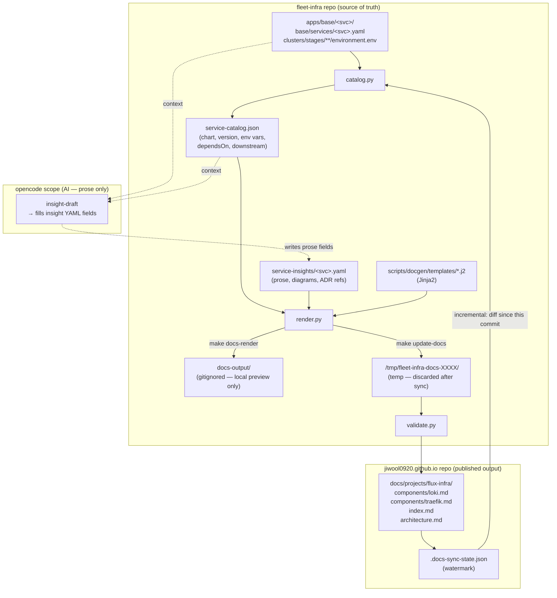
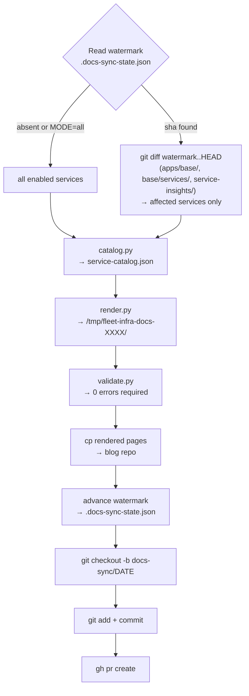
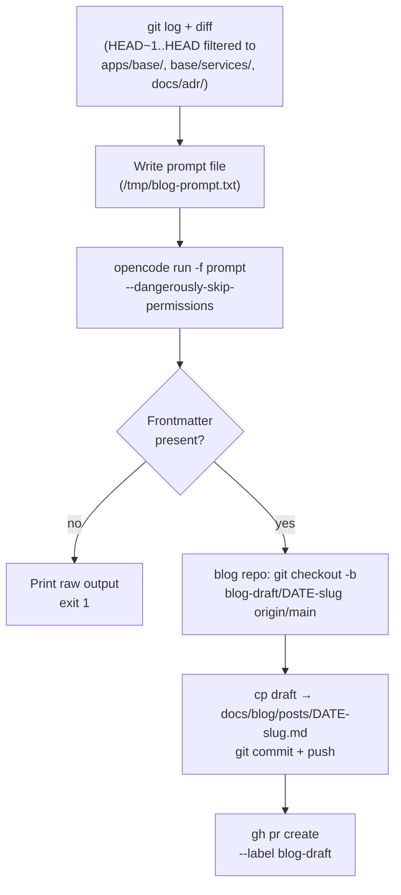

# Content Automation: Blog Posts and Homelab Docs

This document covers the two local automation scripts that keep content in
[jiwool0920.github.io](https://github.com/JiwooL0920/jiwool0920.github.io) in sync
with changes in this repo. Both scripts use your local `opencode` installation and
open cross-repo PRs via `gh` — no CI, no secrets, no auto-merge.

---

## Overview

| Command | What it does | When to run |
|---------|-------------|-------------|
| `make insight-draft SVC=<slug>` | AI-drafts prose fields of `service-insights/<slug>.yaml` | After adding a service or doing an architecture refactor |
| `make insight-draft-all` | Drafts all stubs that still have TODO placeholders | One-time bootstrap after adding many services |
| `make docs-gen` | Local preview: catalog → render → validate → `docs-output/` | Inspect rendered pages before publishing |
| `make update-docs` | Full pipeline + sync to blog repo + open PR | After insight YAML is ready to publish |
| `make blog-draft` | Generates a blog post from recent commits and opens a PR | After a notable infra change lands on develop |

**You always merge manually.** The workflow enforces the GitOps principle: AI drafts,
human reviews, CI deploys on merge.

---

## Component Docs pipeline

### Architecture



**`docs-output/`** is a local preview scratch space only — gitignored, never committed.
The blog repo is the authoritative home for rendered pages.

### Three input layers

| Layer | File(s) | Who writes it | Contains |
|-------|---------|--------------|---------|
| **Catalog** | `service-catalog.json` | `catalog.py` (auto) | Chart, version, namespace, env vars, `dependsOn`, downstream consumers — all extracted from manifests |
| **Insights** | `service-insights/<svc>.yaml` | `insight-draft` (AI) + human review | Prose intro, purpose, rationale, features, architecture diagrams, troubleshooting, ADR refs |
| **Templates** | `scripts/docgen/templates/*.j2` | Human | Jinja2 templates that merge catalog + insights into the final markdown |

Config values (CPU, memory, replicas, chart versions) always come from the catalog —
never from insights. This prevents drift: re-running `make catalog` always reflects the
current manifests.

### Makefile targets

```bash
# One-time setup: create Python venv and install deps
make docs-setup

# Step 1 — Extract live config values from manifests
make catalog                     # writes service-catalog.json

# Step 2 — AI-draft prose + diagrams for a service insight YAML
make insight-draft SVC=loki                        # initial draft (skips already-filled fields)
make insight-draft SVC=loki FORCE=1                # overwrite all fields (post-refactor)
make insight-draft SVC=loki FIELDS=architecture_diagrams   # re-draft one field only
make insight-draft SVC="loki jaeger"               # batch
make insight-draft-all                             # all stubs with TODO placeholders

# Step 3 — Local preview
make docs-render                 # renders to docs-output/ (absolute paths printed)
make docs-validate               # validates headings, tables, mermaid, TODOs
make docs-gen                    # catalog + validate-insights + render + validate

# Step 4 — Publish to blog repo
make update-docs                 # incremental: only services changed since watermark
make update-docs MODE=all        # full: all enabled services
```

### `insight-draft` — AI prose generation

`make insight-draft SVC=<slug>` calls `opencode` with:
- The service's Flux Kustomization and all manifests from `apps/base/<svc>/`
- The service's catalog entry (chart, version, env vars, `dependsOn`, downstream)
- Any ADR files that mention the service
- The `redis-sentinel.yaml` golden example as a style contract

OpenCode is instructed to draft **only** these YAML fields:

| Field | Description |
|-------|-------------|
| `intro` | 2-4 paragraph technical overview of the technology |
| `purpose` | Why this specific service exists in this platform |
| `purpose_rationale` | Why this tech over alternatives (omitted if obvious) |
| `features` | Key capabilities actually configured in the manifests |
| `architecture_diagrams` | `graph TD` topology + optional `sequenceDiagram` for flows |

**Hard constraint:** The LLM never writes config values — those come from
`service-catalog.json`. Every diagram edge must be traceable to a manifest or
catalog entry.

After drafting, `insight_schema.py` validates the YAML and the path is printed:
```
  insight → /Users/jiwoolee/Project/fleet-infra/service-insights/loki.yaml
```

#### Overwrite rules

| Invocation | Behavior |
|-----------|---------|
| `make insight-draft SVC=loki` | Skips already-filled fields — safe to re-run |
| `make insight-draft SVC=loki FORCE=1` | Overwrites all prose fields |
| `make insight-draft SVC=loki FIELDS=architecture_diagrams` | Re-drafts only that field |

### `update-docs` — Sync to blog repo



No LLM is invoked during `update-docs`. Generation is fully deterministic:
same inputs always produce the same output.

#### Watermark

Stored in the blog repo at `docs/projects/flux-infra/.docs-sync-state.json`:

```json
{
  "fleet_infra_commit": "<sha>",
  "synced_at": "2026-06-11T13:48:34Z"
}
```

Tracks which fleet-infra commit the docs were last synced from. On incremental runs,
only services whose files changed since that commit are re-rendered. The watermark
advances to `HEAD` and travels in the same PR as the doc updates — same pattern as
`release-please`'s manifest file.

### Environment overrides

| Variable | Default | Purpose |
|----------|---------|---------|
| `BLOG_REPO_DIR` | `~/Project/jiwool0920.github.io` | Path to local blog clone |
| `BLOG_REPO_GH` | `JiwooL0920/jiwool0920.github.io` | GitHub slug for PR creation |

---

## Blog Posts (`make blog-draft`)

**Script:** `scripts/blog-draft.sh`

Generates a `<!-- more -->`-fenced MkDocs Material post from recent commits and opens a
pull request in `jiwool0920.github.io`.

### Flow



### Usage

```bash
# Default: draft from last commit
make blog-draft

# Draft from a wider range
make blog-draft RANGE=HEAD~3..HEAD

# Preview only (no PR, prints to stdout)
make docs-draft-blog
```

### Prerequisites

- `opencode` installed and authenticated
- `gh` authenticated (`gh auth status` shows JiwooL0920)
- Blog repo cloned at `~/Project/jiwool0920.github.io`

---

## Key design decisions

### LLM scope is strictly bounded

OpenCode is only used in two places:
1. `insight-draft` — drafts prose fields in `service-insights/<svc>.yaml`
2. `blog-draft` — drafts blog posts from commit diffs

Reference documentation (config values, port numbers, chart versions, dependency
graphs) is always derived deterministically from the manifests. This prevents the
hallucinated values and config drift that plagued earlier LLM-generated docs.

### No auto-merge, no CI

Both pipelines open PRs for human review. Same principle as the kagent `gitops-agent`:
AI drafts, human reviews, Flux/GitHub Pages deploys on merge.

### Why the watermark lives in the blog repo

The watermark describes the *documentation's* state, not the source repo's state.
Storing it in the blog repo means it travels in the same PR that updates the docs —
when the PR merges, the watermark merges too, and the next incremental run correctly
starts from that point.

---

## Troubleshooting

### `opencode` hangs

Use `--dangerously-skip-permissions` (already set in `insight_draft.py`). If it
still hangs, check that your `opencode.jsonc` provider is reachable (Ollama running,
or remote API key valid).

### "Branch already exists on origin"

A docs-sync PR is already open. Merge or close it first, or delete the remote branch:

```bash
gh api -X DELETE repos/JiwooL0920/jiwool0920.github.io/git/refs/heads/docs-sync/YYYY-MM-DD
```

### "Blog repo has uncommitted changes"

The script refuses to run if `docs/projects/flux-infra/` has uncommitted changes.
Commit or stash them first.

### Validation errors vs warnings

| Output | Meaning | Action |
|--------|---------|--------|
| `[WARN] N TODO placeholder(s) remain` | Insight stub not yet drafted | Run `make insight-draft SVC=<slug>` |
| `[ERROR] Empty table` | Template rendered a table with no rows | Check `service-catalog.json` for missing data |
| `[ERROR] Missing heading` | Required section absent | Check `service-insights/<svc>.yaml` schema |

### Re-drafting after a refactor

```bash
# Re-draw only the architecture diagram
make insight-draft SVC=loki FIELDS=architecture_diagrams

# Full rewrite of all prose
make insight-draft SVC=loki FORCE=1
```
