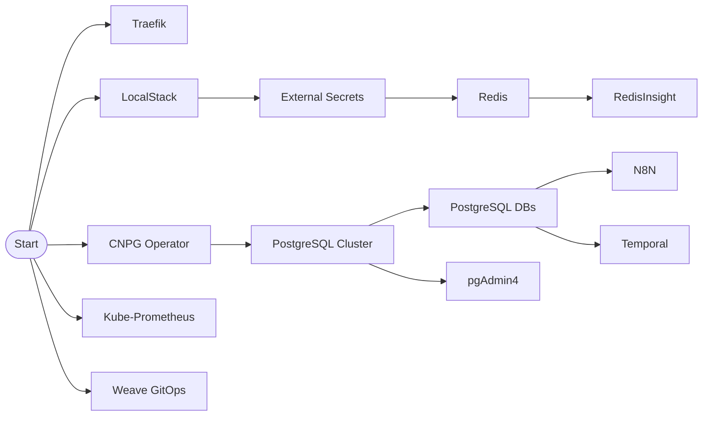

# FluxCD Dependency Management Refactoring Plan

## Executive Summary
This plan focuses on improving deployment performance by replacing coarse-grained wave dependencies with fine-grained service-level dependencies, while preserving the current repository structure and secret management approach.

**Current State**: 30-45 minute deployments with unnecessary sequential waiting
**Target State**: <10 minute deployments with optimized parallel execution
**Key Change**: Replace wave-based dependencies with direct service dependencies

---

## PART 1: Current State Analysis

### 1.1 What We're Keeping (Working Well)
- ✅ Current `clusters/` directory structure
- ✅ LocalStack + External Secrets pattern
- ✅ Environment separation (dev/prod branches)
- ✅ Base kustomization approach

### 1.2 Core Problem: Coarse-Grained Dependencies

**Current Wave Dependencies (Too Broad)**:
```yaml
# Example: pgAdmin4 currently waits for ALL of Wave 4
dependsOn:
  - name: database-workloads  # Includes PostgreSQL AND Redis
```

**Actual Requirements**:
- pgAdmin4 only needs PostgreSQL cluster ready
- RedisInsight only needs Redis ready
- N8N needs PostgreSQL databases created
- Temporal needs PostgreSQL databases created

### 1.3 Unnecessary Sequential Delays

Current deployment sequence with wait times:
```
Wave 1 (5m) → Wave 2 (10m) → Wave 3 (5m) → Wave 4 (15m) → Wave 5 (10m)
                                                         ↑
                                            Services wait for ALL Wave 4
```

Many services could start immediately:
- Monitoring stack (no dependencies)
- Weave GitOps (no dependencies)
- Traefik (no dependencies)

---

## PART 2: Dependency Management Patterns

### 2.1 FluxCD Fine-Grained Dependency Best Practices

**Pattern 1: Direct Service Dependencies**
```yaml
# BEFORE: Coarse wave dependency
apiVersion: kustomize.toolkit.fluxcd.io/v1
kind: Kustomization
metadata:
  name: pgadmin4
spec:
  dependsOn:
    - name: database-workloads  # Waits for Redis AND PostgreSQL

# AFTER: Fine-grained dependency
apiVersion: kustomize.toolkit.fluxcd.io/v1
kind: Kustomization
metadata:
  name: pgadmin4
spec:
  dependsOn:
    - name: postgresql-cluster  # Only waits for PostgreSQL
  healthChecks:
    - apiVersion: v1
      kind: Secret
      name: postgresql-cluster-app
      namespace: cnpg-system
```

**Pattern 2: Health-Based Dependencies**
```yaml
# Use health checks instead of timeouts
spec:
  dependsOn:
    - name: cnpg-operator
  healthChecks:
    - apiVersion: apps/v1
      kind: Deployment
      name: cnpg-cloudnative-pg
      namespace: cnpg-system
  timeout: 2m  # Reduced from 10m
```

**Pattern 3: Parallel Service Groups**
```yaml
# Services with no dependencies start immediately
# No dependsOn clause = starts immediately
metadata:
  name: kube-prometheus-stack
spec:
  # No dependsOn - starts in parallel with everything else
  interval: 5m
  retryInterval: 1m
```

### 2.2 Service Dependency Matrix

| Service | Current Dependencies | Actual Requirements | Can Parallelize With |
|---------|---------------------|--------------------|--------------------|
| **Traefik** | None | None | Everything |
| **LocalStack** | None | None | Everything |
| **CNPG Operator** | infrastructure-core | None | Everything except PostgreSQL |
| **External Secrets** | infrastructure-core | LocalStack healthy | Most services |
| **PostgreSQL Cluster** | infrastructure-operators | CNPG Operator ready | Redis, Monitoring |
| **Redis** | infrastructure-operators | External Secrets ready | PostgreSQL, Monitoring |
| **Kube-Prometheus** | infrastructure-config | None | Everything |
| **Weave GitOps** | infrastructure-config | None | Everything |
| **N8N** | services | PostgreSQL DB created | Temporal, Redis |
| **Temporal** | services | PostgreSQL DB created | N8N, Redis |
| **pgAdmin4** | database-workloads | PostgreSQL cluster ready | RedisInsight |
| **RedisInsight** | database-workloads | Redis ready | pgAdmin4 |

### 2.3 Optimized Dependency Graph



---

## PART 3: Implementation Plan

### 3.1 Phase 1: Create Individual Service Kustomizations (Week 1)

**Step 1.1: Split wave-based kustomizations into service-level**

Current structure:
```
base/
├── infrastructure-core.yaml      # Wave 1 aggregation
├── infrastructure-operators.yaml # Wave 2 aggregation
└── database-workloads.yaml      # Wave 4 aggregation
```

New structure (ADD, don't remove old yet):
```
base/
├── infrastructure-core.yaml      # Keep for now
├── infrastructure-operators.yaml # Keep for now
├── database-workloads.yaml      # Keep for now
├── services/                     # ADD NEW
│   ├── traefik.yaml
│   ├── localstack.yaml
│   ├── cnpg-operator.yaml
│   ├── external-secrets.yaml
│   ├── postgresql-cluster.yaml
│   ├── redis.yaml
│   ├── kube-prometheus.yaml
│   ├── weave-gitops.yaml
│   ├── n8n.yaml
│   ├── temporal.yaml
│   ├── pgadmin4.yaml
│   └── redisinsight.yaml
```

**Example: postgresql-cluster.yaml**
```yaml
apiVersion: kustomize.toolkit.fluxcd.io/v1
kind: Kustomization
metadata:
  name: postgresql-cluster
  namespace: flux-system
spec:
  interval: 10m
  retryInterval: 1m
  timeout: 5m  # Reduced from 15m
  sourceRef:
    kind: GitRepository
    name: flux-system
  path: ./apps/base/cloudnative-pg
  prune: true
  wait: true
  dependsOn:
    - name: cnpg-operator
  healthChecks:
    - apiVersion: apps/v1
      kind: Deployment
      name: cnpg-cloudnative-pg
      namespace: cnpg-system
```

### 3.2 Phase 2: Update clusters/ References (Week 1-2)

**Step 2.1: Update dev environment first**

File: `/clusters/stages/dev/clusters/services-amer/kustomization.yaml`

```yaml
apiVersion: kustomize.config.k8s.io/v1beta1
kind: Kustomization
resources:
  - ../../../../base/services/traefik.yaml        # No deps - starts immediately
  - ../../../../base/services/localstack.yaml     # No deps - starts immediately
  - ../../../../base/services/cnpg-operator.yaml  # No deps - starts immediately
  - ../../../../base/services/kube-prometheus.yaml # No deps - starts immediately
  - ../../../../base/services/weave-gitops.yaml   # No deps - starts immediately
  - ../../../../base/services/external-secrets.yaml # Depends on LocalStack
  - ../../../../base/services/postgresql-cluster.yaml # Depends on CNPG Operator
  - ../../../../base/services/redis.yaml          # Depends on External Secrets
  - ../../../../base/services/n8n.yaml            # Depends on PostgreSQL DBs
  - ../../../../base/services/temporal.yaml       # Depends on PostgreSQL DBs
  - ../../../../base/services/pgadmin4.yaml       # Depends on PostgreSQL
  - ../../../../base/services/redisinsight.yaml   # Depends on Redis
```

### 3.3 Phase 3: Add Fine-Grained Dependencies (Week 2)

**Step 3.1: Update each service kustomization with specific dependencies**

**n8n.yaml** (example):
```yaml
apiVersion: kustomize.toolkit.fluxcd.io/v1
kind: Kustomization
metadata:
  name: n8n
  namespace: flux-system
spec:
  interval: 5m
  retryInterval: 1m
  timeout: 3m
  sourceRef:
    kind: GitRepository
    name: flux-system
  path: ./apps/base/n8n
  prune: true
  wait: true
  dependsOn:
    - name: postgresql-cluster
  healthChecks:
    # Check that the specific database exists
    - apiVersion: v1
      kind: Secret
      name: postgresql-cluster-app
      namespace: cnpg-system
    # Check that n8n database is configured
    - apiVersion: batch/v1
      kind: Job
      name: postgres-init-n8n-db
      namespace: cnpg-system
```

**pgadmin4.yaml**:
```yaml
apiVersion: kustomize.toolkit.fluxcd.io/v1
kind: Kustomization
metadata:
  name: pgadmin4
  namespace: flux-system
spec:
  interval: 5m
  retryInterval: 30s
  timeout: 2m  # Reduced from 10m
  sourceRef:
    kind: GitRepository
    name: flux-system
  path: ./apps/base/pgadmin4
  prune: true
  wait: true
  dependsOn:
    - name: postgresql-cluster  # Only PostgreSQL, not Redis
  healthChecks:
    - apiVersion: postgresql.cnpg.io/v1
      kind: Cluster
      name: postgresql-cluster
      namespace: cnpg-system
```

### 3.4 Phase 4: Remove Wave Dependencies (Week 3)

After validating fine-grained dependencies work:

1. Remove old wave aggregation files:
   - `base/infrastructure-core.yaml`
   - `base/infrastructure-operators.yaml`
   - `base/database-workloads.yaml`

2. Update any remaining references

### 3.5 Validation Approach

**Test Script: validate-dependencies.sh**
```bash
#!/bin/bash
# Validate dependency optimization

echo "Starting dependency validation..."

# 1. Record start time
START_TIME=$(date +%s)

# 2. Apply configuration
flux reconcile source git flux-system
flux reconcile kustomization flux-system

# 3. Monitor parallel deployments
watch -n 5 'kubectl get kustomizations -n flux-system | grep -E "True|False|Unknown"'

# 4. Check final deployment time
END_TIME=$(date +%s)
DURATION=$((END_TIME - START_TIME))
echo "Total deployment time: ${DURATION} seconds"

# 5. Verify all services are healthy
flux get all --status-selector ready=true
```

---

## Expected Improvements

### Deployment Time Reduction

| Phase | Current Time | Optimized Time | Improvement |
|-------|-------------|----------------|-------------|
| **Core Services** | 5m sequential | 2m parallel | -60% |
| **Operators** | 10m sequential | 3m parallel | -70% |
| **Databases** | 15m sequential | 5m parallel | -67% |
| **Applications** | 10m sequential | 3m parallel | -70% |
| **Total** | 30-45m | 8-10m | **-75%** |

### Parallelization Gains

**Services Starting Immediately** (T+0):
- Traefik
- LocalStack
- CNPG Operator
- Kube-Prometheus Stack
- Weave GitOps

**Services Starting at T+2m**:
- External Secrets (after LocalStack health)
- PostgreSQL Cluster (after CNPG ready)

**Services Starting at T+5m**:
- Redis (after External Secrets)
- N8N (after PostgreSQL DBs)
- Temporal (after PostgreSQL DBs)
- pgAdmin4 (after PostgreSQL)
- RedisInsight (after Redis)

---

## Migration Checklist

### Week 1: Preparation
- [ ] Create service-level kustomization files in `base/services/`
- [ ] Map exact dependencies for each service
- [ ] Set up parallel test environment

### Week 2: Implementation
- [ ] Update dev environment to use new kustomizations
- [ ] Add fine-grained dependsOn clauses
- [ ] Add health checks to replace timeouts
- [ ] Test deployment in dev

### Week 3: Validation
- [ ] Measure deployment times
- [ ] Verify service health
- [ ] Test failure scenarios
- [ ] Document rollback procedure

### Week 4: Production Rollout
- [ ] Apply changes to production branch
- [ ] Monitor first production deployment
- [ ] Remove old wave files after validation
- [ ] Update documentation

---

## Rollback Plan

If issues occur, rollback is simple:

1. **Revert to wave dependencies**:
   ```bash
   git revert <commit-hash>
   flux reconcile source git flux-system
   ```

2. **Keep both patterns temporarily**:
   - Leave wave files in place
   - Run fine-grained in dev
   - Keep waves in prod until validated

3. **Gradual migration**:
   - Migrate one service at a time
   - Test each dependency change
   - Roll forward only after validation

---

## Success Criteria

- ✅ Deployment time reduced to <10 minutes
- ✅ All services reach ready state
- ✅ No dependency deadlocks
- ✅ Parallel services start simultaneously
- ✅ Health checks prevent cascading failures
- ✅ Rollback tested and documented

---

## Next Steps

1. **Immediate Action**: Create first service kustomization file (suggest starting with `traefik.yaml`)
2. **Test in Dev**: Apply to development environment first
3. **Measure Results**: Compare deployment times before/after
4. **Iterate**: Refine dependencies based on observed behavior
5. **Document**: Update CLAUDE.md with new dependency model

This approach maintains your working infrastructure while dramatically improving deployment performance through intelligent dependency management.
