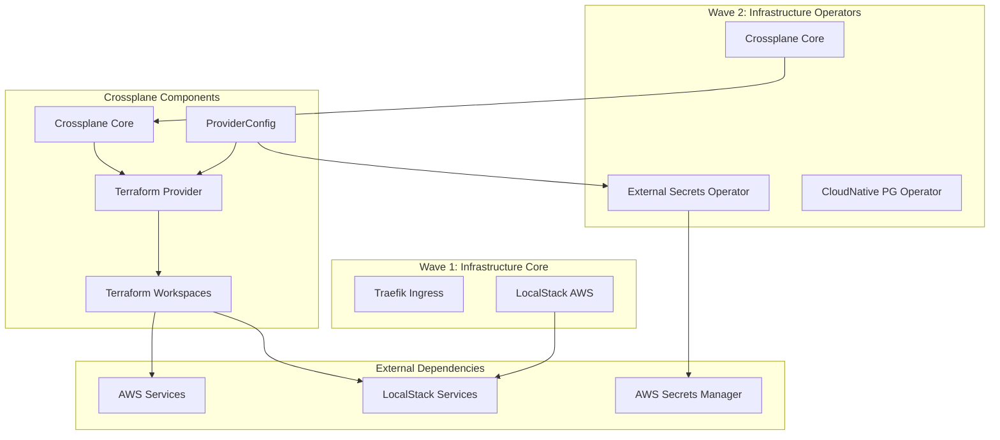

# Crossplane Implementation Documentation

## Table of Contents

1. [Overview](#overview)
2. [Architecture](#architecture)
3. [Installation & Configuration](#installation--configuration)
4. [Provider Setup](#provider-setup)
5. [Resource Management](#resource-management)
6. [Environment Configuration](#environment-configuration)
7. [Usage Examples](#usage-examples)
8. [Troubleshooting](#troubleshooting)
9. [Best Practices](#best-practices)
10. [References](#references)

## Overview

Crossplane is deployed in the fleet-infra repository as a Kubernetes add-on that enables infrastructure provisioning through GitOps. It extends Kubernetes to manage cloud infrastructure using the same declarative API model.

### Key Features

- **Infrastructure as Code**: Define AWS resources using Kubernetes CRDs
- **GitOps Integration**: Fully integrated with Flux CD for automated deployments
- **Multi-Environment Support**: Separate configurations for dev (LocalStack) and prod (AWS)
- **Secret Management**: Integrated with External Secrets Operator for credential management
- **Wave-Based Deployment**: Deployed in Wave 2 alongside other infrastructure operators

### Current Implementation Status

- ✅ Core Crossplane deployed (v1.18.2)
- ✅ Terraform Provider installed for LocalStack compatibility
- ✅ External Secrets integration configured
- ✅ LocalStack support for development with Terraform AWS provider
- ✅ Environment-specific configurations
- ✅ Initialization scripts created
- ✅ LocalStack compatibility resolved via Terraform Provider bridge
- 🔄 Compositions development (Phase 2)
- 📋 Application integration (Phase 3)

## Architecture

### Component Hierarchy



### Directory Structure

```
fleet-infra/
├── apps/base/crossplane/
│   ├── crossplane-base/
│   │   ├── helmrelease.yaml        # Crossplane Helm deployment
│   │   ├── kustomization.yaml      # Core Crossplane resources
│   │   └── namespace.yaml          # crossplane-system namespace
│   ├── provider-aws/
│   │   ├── kustomization.yaml      # Provider installation
│   │   └── provider-aws.yaml       # Terraform provider setup
│   ├── crossplane-config/
│   │   ├── kustomization.yaml      # Configuration resources
│   │   ├── provider-config.yaml    # Terraform provider configurations
│   │   ├── compositions/           # Reusable templates
│   │   └── test-bucket.yaml        # LocalStack test resources
│   └── kustomization.yaml          # Main orchestration
├── base/infrastructure/
│   ├── operators/
│   │   └── crossplane.yaml         # Wave 2 Kustomization
│   └── config/
│       └── crossplane-config.yaml  # Wave 3 Configuration
├── scripts/
│   └── init-crossplane-secrets.sh  # AWS credentials initialization
└── docs/
    ├── crossplane-implementation.md     # This document
    └── crossplane-implementation-plan.md # Planning document
```

## Installation & Configuration

### Prerequisites

1. **Kubernetes Cluster**: v1.27+ with Flux CD installed
2. **External Secrets Operator**: Must be deployed and configured
3. **LocalStack**: Required for development environment
4. **AWS CLI**: For secret initialization

### Installation Steps

#### 1. Initialize AWS Credentials

```bash
# Initialize Crossplane AWS secrets in LocalStack
make init-aws-secrets

# Or run directly
./scripts/init-crossplane-secrets.sh
```

This creates:

- AWS credentials in LocalStack Secrets Manager
- S3 bucket for state storage
- Required secret mappings for External Secrets

#### 2. Deploy Crossplane

Crossplane is automatically deployed through Flux CD as part of Wave 2:

```bash
# Check deployment status
flux get kustomization infrastructure-operators

# Check Crossplane pods
kubectl get pods -n crossplane-system

# Verify Helm release
kubectl get helmrelease -n flux-system crossplane
```

#### 3. Verify Provider Installation

```bash
# Check provider health
kubectl get providers

# Expected output:
NAME                INSTALLED   HEALTHY   PACKAGE
provider-aws-s3     True        True      xpkg.upbound.io/upbound/provider-aws-s3:v1.16.0
provider-aws-iam    True        True      xpkg.upbound.io/upbound/provider-aws-iam:v1.16.0
provider-aws-ec2    True        True      xpkg.upbound.io/upbound/provider-aws-ec2:v1.16.0
```

### Core Configuration

#### Helm Values (helmrelease.yaml)

```yaml
spec:
  values:
    # Resource limits for production
    resourcesCrossplane:
      limits:
        cpu: 500m
        memory: 512Mi
      requests:
        cpu: 100m
        memory: 256Mi

    # Enable critical features
    args:
      - --enable-composition-functions
      - --enable-composition-webhook-schema-validation
      - --enable-environment-configs

    # Metrics for monitoring
    metrics:
      enabled: true

    # Environment variables for AWS
    extraEnvVarsCrossplane:
      AWS_REGION:
        value: "${AWS_REGION}"
      AWS_ENDPOINT_URL:
        value: "${AWS_ENDPOINT_URL}"
```

## Provider Setup

### Terraform Provider for LocalStack Compatibility

The implementation uses the Crossplane Terraform Provider as a bridge to enable LocalStack compatibility. This approach uses the standard Terraform AWS provider, which has proven LocalStack support, within Crossplane Workspaces.

```yaml
# provider-aws.yaml
apiVersion: pkg.crossplane.io/v1
kind: Provider
metadata:
  name: provider-terraform
spec:
  package: xpkg.upbound.io/upbound/provider-terraform:v0.15.0
  packagePullPolicy: IfNotPresent
  revisionActivationPolicy: Automatic
  revisionHistoryLimit: 1
```

### Why Terraform Provider?

The AWS Community Provider and Upbound AWS providers don't support endpoint configuration needed for LocalStack. The Terraform Provider solves this by:

1. **LocalStack Compatibility**: Terraform AWS provider supports custom endpoints
2. **Familiar Syntax**: Uses standard Terraform HCL configuration
3. **Proven Integration**: Terraform has established LocalStack support
4. **Bridge Architecture**: Runs Terraform within Crossplane for unified management

### Provider Configuration

#### Development (LocalStack)

```yaml
apiVersion: aws.upbound.io/v1beta1
kind: ProviderConfig
metadata:
  name: default
spec:
  credentials:
    source: Secret
    secretRef:
      namespace: crossplane-system
      name: aws-credentials
      key: credentials
  endpoint:
    url:
      type: Static
      static: "http://localstack.localstack.svc.cluster.local:4566"
  skip_credentials_validation: true
  skip_requesting_account_id: true
  s3_use_path_style: true
```

#### Production (AWS)

```yaml
apiVersion: aws.upbound.io/v1beta1
kind: ProviderConfig
metadata:
  name: aws-production
spec:
  credentials:
    source: Secret # Or InjectedIdentity for IRSA
    secretRef:
      namespace: crossplane-system
      name: aws-credentials
      key: credentials
  # No custom endpoint - uses real AWS
```

### External Secrets Integration

The AWS credentials are managed by External Secrets Operator:

```yaml
apiVersion: external-secrets.io/v1beta1
kind: ExternalSecret
metadata:
  name: crossplane-aws-credentials
  namespace: crossplane-system
spec:
  refreshInterval: 5m
  secretStoreRef:
    name: cluster-secret-store
    kind: ClusterSecretStore
  target:
    name: aws-credentials
    template:
      data:
        credentials: |
          [default]
          aws_access_key_id={{ .aws_access_key_id }}
          aws_secret_access_key={{ .aws_secret_access_key }}
  data:
    - secretKey: aws_access_key_id
      remoteRef:
        key: crossplane/aws
        property: access_key_id
    - secretKey: aws_secret_access_key
      remoteRef:
        key: crossplane/aws
        property: secret_access_key
```

## Resource Management

### Creating AWS Resources

#### Example: S3 Bucket

```yaml
apiVersion: s3.aws.upbound.io/v1beta1
kind: Bucket
metadata:
  name: my-crossplane-bucket
  namespace: default
spec:
  forProvider:
    region: us-east-1
    tags:
      Environment: dev
      ManagedBy: crossplane
  providerConfigRef:
    name: default # Uses LocalStack in dev
```

#### Example: IAM Role

```yaml
apiVersion: iam.aws.upbound.io/v1beta1
kind: Role
metadata:
  name: my-app-role
spec:
  forProvider:
    assumeRolePolicyDocument: |
      {
        "Version": "2012-10-17",
        "Statement": [{
          "Effect": "Allow",
          "Principal": {
            "Service": "ec2.amazonaws.com"
          },
          "Action": "sts:AssumeRole"
        }]
      }
  providerConfigRef:
    name: default
```

#### Example: VPC with Subnets

```yaml
apiVersion: ec2.aws.upbound.io/v1beta1
kind: VPC
metadata:
  name: my-vpc
spec:
  forProvider:
    region: us-east-1
    cidrBlock: 10.0.0.0/16
    enableDnsHostnames: true
    enableDnsSupport: true
    tags:
      Name: crossplane-vpc
  providerConfigRef:
    name: default
---
apiVersion: ec2.aws.upbound.io/v1beta1
kind: Subnet
metadata:
  name: my-subnet-1
spec:
  forProvider:
    region: us-east-1
    vpcIdSelector:
      matchLabels:
        name: my-vpc
    cidrBlock: 10.0.1.0/24
    availabilityZone: us-east-1a
    mapPublicIpOnLaunch: true
    tags:
      Name: crossplane-subnet-1
  providerConfigRef:
    name: default
```

## Environment Configuration

### cluster-vars ConfigMap

Environment-specific variables are managed through the cluster-vars ConfigMap:

#### Development (dev/base/cluster-vars-patch.yaml)

```yaml
apiVersion: v1
kind: ConfigMap
metadata:
  name: cluster-vars
  namespace: flux-system
data:
  # LocalStack configuration
  AWS_ENDPOINT_URL: "http://localstack.localstack.svc.cluster.local:4566"
  SKIP_CREDENTIALS_VALIDATION: "true"
  SKIP_REQUESTING_ACCOUNT_ID: "true"
  S3_USE_PATH_STYLE: "true"
```

#### Production (prod/base/cluster-vars-patch.yaml)

```yaml
apiVersion: v1
kind: ConfigMap
metadata:
  name: cluster-vars
  namespace: flux-system
data:
  # Real AWS configuration
  AWS_ENDPOINT_URL: ""
  SKIP_CREDENTIALS_VALIDATION: "false"
  SKIP_REQUESTING_ACCOUNT_ID: "false"
  S3_USE_PATH_STYLE: "false"
```

## Usage Examples

### 1. PostgreSQL Backup Bucket

Create an S3 bucket for CNPG backups:

```yaml
apiVersion: s3.aws.upbound.io/v1beta1
kind: Bucket
metadata:
  name: cnpg-backups
  namespace: cnpg-system
spec:
  forProvider:
    region: us-east-1
    versioning:
      - enabled: true
    lifecycleRule:
      - id: expire-old-backups
        enabled: true
        expiration:
          - days: 30
    serverSideEncryptionConfiguration:
      - rule:
          - applyServerSideEncryptionByDefault:
              - sseAlgorithm: AES256
    tags:
      Purpose: database-backups
      ManagedBy: crossplane
  providerConfigRef:
    name: default
```

### 2. Application IAM Policy

Create an IAM policy for application access:

```yaml
apiVersion: iam.aws.upbound.io/v1beta1
kind: Policy
metadata:
  name: n8n-s3-access
spec:
  forProvider:
    description: "S3 access for N8N workflows"
    policy: |
      {
        "Version": "2012-10-17",
        "Statement": [
          {
            "Effect": "Allow",
            "Action": [
              "s3:GetObject",
              "s3:PutObject",
              "s3:DeleteObject"
            ],
            "Resource": "arn:aws:s3:::n8n-workflows/*"
          }
        ]
      }
  providerConfigRef:
    name: default
```

### 3. Security Group for RDS

```yaml
apiVersion: ec2.aws.upbound.io/v1beta1
kind: SecurityGroup
metadata:
  name: rds-security-group
spec:
  forProvider:
    region: us-east-1
    description: "Security group for RDS database"
    vpcIdSelector:
      matchLabels:
        name: my-vpc
    ingress:
      - fromPort: 5432
        toPort: 5432
        ipProtocol: tcp
        cidrBlocks:
          - 10.0.0.0/16
    egress:
      - fromPort: 0
        toPort: 0
        ipProtocol: "-1"
        cidrBlocks:
          - 0.0.0.0/0
  providerConfigRef:
    name: default
```

## Troubleshooting

### Common Issues and Solutions

#### 1. Provider Not Healthy

```bash
# Check provider status
kubectl get providers

# Check provider pods
kubectl get pods -n crossplane-system

# View provider logs
kubectl logs -n crossplane-system deployment/provider-aws-s3
```

**Solution**: Usually caused by missing credentials or network issues. Verify External Secrets are synced:

```bash
kubectl get externalsecrets -n crossplane-system
kubectl describe secret aws-credentials -n crossplane-system
```

#### 2. Resources Stuck in Creating State

```bash
# Check resource events
kubectl describe bucket my-bucket

# Check Crossplane logs
kubectl logs -n crossplane-system deployment/crossplane
```

**Common causes**:

- LocalStack not accessible
- Invalid AWS credentials
- Missing IAM permissions
- Network connectivity issues

#### 3. External Secrets Not Syncing

```bash
# Check ClusterSecretStore
kubectl get clustersecretstore
kubectl describe clustersecretstore cluster-secret-store

# Check LocalStack secrets
aws --endpoint-url=http://localhost:4566 secretsmanager list-secrets
```

**Solution**: Re-run initialization script:

```bash
make init-aws-secrets
```

#### 4. LocalStack Connection Issues

```bash
# Test LocalStack connectivity
curl http://localhost:4566/_localstack/health

# Check LocalStack pods
kubectl get pods -n localstack

# Restart port forwarding
make port-forward
```

### Debug Commands

```bash
# Get all Crossplane resources
kubectl get crossplane

# Check managed resource details
kubectl describe bucket.s3.aws.upbound.io my-bucket

# View provider configuration
kubectl get providerconfig

# Check composition status (if using)
kubectl get compositions

# View all CRDs installed by Crossplane
kubectl get crd | grep crossplane
kubectl get crd | grep aws.upbound.io
```

## Best Practices

### 1. Resource Naming

- Use descriptive names with environment prefixes
- Follow Kubernetes naming conventions
- Include purpose in resource names

```yaml
metadata:
  name: dev-app-config-bucket  # Good
  name: bucket1               # Bad
```

### 2. Tagging Strategy

Always include standard tags:

```yaml
tags:
  Environment: ${ENVIRONMENT}
  ManagedBy: crossplane
  Team: platform
  CostCenter: engineering
  GitRepo: fleet-infra
```

### 3. Resource Dependencies

Use selectors for cross-resource references:

```yaml
spec:
  forProvider:
    vpcIdSelector:
      matchLabels:
        purpose: main-vpc
    # Instead of hardcoding:
    # vpcId: vpc-123456
```

### 4. Secret Management

- Never hardcode credentials
- Use External Secrets for all sensitive data
- Rotate credentials regularly
- Use least-privilege IAM policies

### 5. Environment Separation

- Use different ProviderConfigs for each environment
- Implement proper RBAC
- Use namespaces for isolation
- Test in development before production

### 6. Composition Design

When creating compositions:

```yaml
apiVersion: apiextensions.crossplane.io/v1
kind: Composition
metadata:
  name: xbuckets.storage.example.com
spec:
  compositeTypeRef:
    apiVersion: storage.example.com/v1alpha1
    kind: XBucket
  mode: Pipeline
  pipeline:
    - step: patch-and-transform
      functionRef:
        name: function-patch-and-transform
      input:
        apiVersion: pt.fn.crossplane.io/v1beta1
        kind: Resources
        resources:
          - name: s3-bucket
            base:
              apiVersion: s3.aws.upbound.io/v1beta1
              kind: Bucket
            patches:
              - type: FromCompositeFieldPath
                fromFieldPath: spec.region
                toFieldPath: spec.forProvider.region
```

### 7. Monitoring and Alerting

Configure Prometheus metrics:

```yaml
# ServiceMonitor for Crossplane
apiVersion: monitoring.coreos.com/v1
kind: ServiceMonitor
metadata:
  name: crossplane
  namespace: crossplane-system
spec:
  selector:
    matchLabels:
      app: crossplane
  endpoints:
    - port: metrics
      interval: 30s
```

## Advanced Configuration

### Using Composition Functions

Enable advanced resource composition:

```yaml
apiVersion: pkg.crossplane.io/v1
kind: Function
metadata:
  name: function-patch-and-transform
spec:
  package: xpkg.upbound.io/crossplane-contrib/function-patch-and-transform:v0.4.0
```

### Multi-Region Support

Configure providers for multiple regions:

```yaml
apiVersion: aws.upbound.io/v1beta1
kind: ProviderConfig
metadata:
  name: us-west-2
spec:
  credentials:
    source: Secret
    secretRef:
      namespace: crossplane-system
      name: aws-credentials
      key: credentials
  region: us-west-2
```

### IRSA (IAM Roles for Service Accounts)

For EKS clusters, use IRSA for better security:

```yaml
apiVersion: aws.upbound.io/v1beta1
kind: ProviderConfig
metadata:
  name: irsa-provider
spec:
  credentials:
    source: IRSA
```

## Migration Guide

### Migrating Existing Resources

1. **Import existing resources**:

```yaml
metadata:
  annotations:
    crossplane.io/external-name: existing-bucket-name
```

2. **Adopt management**:

```bash
kubectl annotate bucket my-bucket crossplane.io/external-create-succeeded=true
```

3. **Verify state**:

```bash
kubectl get bucket my-bucket -o yaml
```

## Performance Tuning

### Controller Configuration

Adjust reconciliation rates:

```yaml
# In helmrelease.yaml
spec:
  values:
    args:
      - --max-reconcile-rate=100
      - --poll-interval=1m
      - --sync-period=10m
```

### Resource Limits

Set appropriate resource limits based on workload:

```yaml
resources:
  limits:
    cpu: 1000m
    memory: 1Gi
  requests:
    cpu: 250m
    memory: 512Mi
```

## Security Considerations

### 1. RBAC Configuration

Limit Crossplane permissions:

```yaml
apiVersion: rbac.authorization.k8s.io/v1
kind: ClusterRole
metadata:
  name: crossplane-admin
rules:
  - apiGroups: ["*"]
    resources: ["*"]
    verbs: ["get", "list", "watch", "create", "update", "patch"]
```

### 2. Network Policies

Restrict egress traffic:

```yaml
apiVersion: networking.k8s.io/v1
kind: NetworkPolicy
metadata:
  name: crossplane-egress
  namespace: crossplane-system
spec:
  podSelector:
    matchLabels:
      app: crossplane
  policyTypes:
    - Egress
  egress:
    - to:
        - namespaceSelector:
            matchLabels:
              name: localstack
    - to:
        - podSelector: {}
    - ports:
        - protocol: TCP
          port: 443 # HTTPS for AWS API
```

### 3. Secret Encryption

Enable encryption at rest:

```bash
# Encrypt secrets in etcd
kubectl create secret generic encryption-config \
  --from-file=encryption-config.yaml \
  -n kube-system
```

## Disaster Recovery

### Backup Strategy

1. **Configuration backup**:

```bash
# Backup all Crossplane resources
kubectl get crossplane -A -o yaml > crossplane-backup.yaml
```

2. **State preservation**:

```bash
# Export managed resource states
kubectl get managed -A -o yaml > managed-resources-backup.yaml
```

3. **Provider configuration backup**:

```bash
# Backup provider configs
kubectl get providerconfig -o yaml > provider-configs.yaml
```

### Recovery Procedures

1. **Restore Crossplane**:

```bash
# Reinstall Crossplane
flux reconcile kustomization infrastructure-operators

# Wait for providers
kubectl wait --for=condition=Healthy providers --all --timeout=5m

# Restore configurations
kubectl apply -f crossplane-backup.yaml
```

2. **Verify resource state**:

```bash
# Check resource sync status
kubectl get managed -A

# Force reconciliation if needed
kubectl annotate bucket my-bucket crossplane.io/reconcile-now=$(date +%s)
```

## Integration with Other Tools

### Prometheus Monitoring

```yaml
# PrometheusRule for Crossplane alerts
apiVersion: monitoring.coreos.com/v1
kind: PrometheusRule
metadata:
  name: crossplane-alerts
  namespace: crossplane-system
spec:
  groups:
    - name: crossplane
      rules:
        - alert: CrossplaneProviderUnhealthy
          expr: up{job="crossplane-provider"} == 0
          for: 5m
          annotations:
            summary: "Crossplane provider is unhealthy"
        - alert: CrossplaneReconciliationError
          expr: rate(controller_runtime_reconcile_errors_total[5m]) > 0
          for: 10m
          annotations:
            summary: "Crossplane reconciliation errors detected"
```

### Grafana Dashboards

Import dashboard for Crossplane monitoring:

- Dashboard ID: 13485 (Crossplane Metrics)
- Dashboard ID: 14127 (Provider Metrics)

### GitOps with Flux

Crossplane resources can be managed through Flux:

```yaml
apiVersion: kustomize.toolkit.fluxcd.io/v1
kind: Kustomization
metadata:
  name: crossplane-resources
  namespace: flux-system
spec:
  interval: 10m
  path: ./infrastructure/crossplane
  prune: true
  sourceRef:
    kind: GitRepository
    name: flux-system
```

## Future Enhancements

### Planned Features

1. **Phase 2: Compositions** (In Progress)

   - Reusable infrastructure templates
   - Multi-resource compositions
   - Environment-specific configurations

2. **Phase 3: Application Integration**

   - Migrate existing AWS resources
   - Implement service dependencies
   - Automated provisioning workflows

3. **Phase 4: Advanced Features**
   - Multi-cloud support (Azure, GCP)
   - Cost optimization policies
   - Automated compliance checking
   - Drift detection and remediation

### Roadmap

- Q1 2025: Complete composition library
- Q2 2025: Full application integration
- Q3 2025: Multi-cloud support
- Q4 2025: Advanced automation features

## References

### Official Documentation

- [Crossplane Documentation](https://docs.crossplane.io/)
- [Upbound AWS Provider](https://marketplace.upbound.io/providers/upbound/provider-family-aws/)
- [Composition Functions](https://docs.crossplane.io/latest/concepts/composition-functions/)

### Community Resources

- [Crossplane Slack](https://slack.crossplane.io/)
- [GitHub Repository](https://github.com/crossplane/crossplane)
- [Upbound Marketplace](https://marketplace.upbound.io/)

### Related Documentation

- [External Secrets Operator](https://external-secrets.io/)
- [Flux CD Documentation](https://fluxcd.io/)
- [LocalStack Documentation](https://docs.localstack.cloud/)

### Training Resources

- [Crossplane Tutorial](https://docs.crossplane.io/latest/getting-started/)
- [AWS Provider Examples](https://github.com/upbound/provider-aws/tree/main/examples)
- [Composition Patterns](https://docs.crossplane.io/knowledge-base/guides/composition-patterns/)
