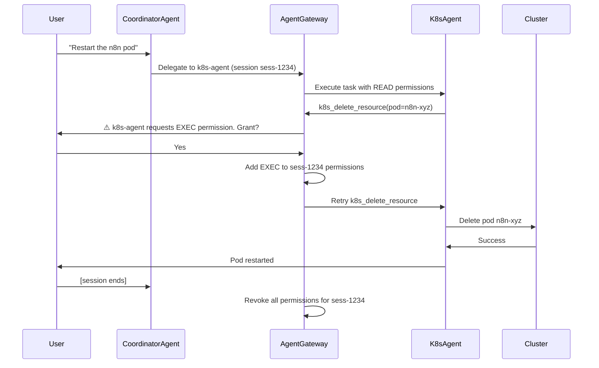

# kagent Permission Keys Design

## Problem Statement

kagent agents operate in a multi-tenant Kubernetes environment where security boundaries must be enforced at runtime. Currently, `requireApproval` gates in Agent CRDs force human approval before executing high-risk operations (apply, delete, push, merge). This works but is coarse-grained and lacks semantic richness for future multi-cluster, multi-session scenarios.

**Permission keys** are the next evolution: a cluster-scoped, session-bound authorization system that replaces binary approval gates with graduated permission levels, enabling fine-grained control and future extensibility when agentgateway arrives.

---

## Permission Levels

kagent defines **5 semantic permission levels** that map to operational risk and blast radius:

### 1. READ (No approval required)
**Scope:** Query and observe without modification.

**Operations:**
- `k8s_get_resources` — list pods, deployments, services
- `k8s_describe_resource` — inspect resource details
- `k8s_get_pod_logs` — read container logs
- `k8s_get_events` — read cluster events
- GitHub `get_file_contents` — read repository files
- GitHub `search_code` — search codebase

**Agents with READ-only access:**
- `observability-agent` — metrics/logs/dashboards
- `helm-agent` — Helm release inspection
- `security-agent` — RBAC audit (read-only queries)
- `finops-agent` — cost analysis (read-only queries)

**Session behavior:** No approval gate. Always allowed.

---

### 2. ANNOTATE (Approval required)
**Scope:** Metadata-only changes that do not alter workload behavior.

**Operations:**
- `k8s_annotate_resource` — add/update annotations (e.g., `fluxcd.io/reconcile=enabled`)
- `k8s_patch_resource` — patch Flux CRDs to trigger reconciliation (`spec.suspend: false`)

**Current mapping:**
- **flux-agent** lines 42-44:
  ```yaml
  requireApproval:
    - k8s_annotate_resource
    - k8s_patch_resource
  ```

**Why approval required:**
- Annotations can trigger Flux reconciliation loops
- Patching `spec.suspend` resumes deployments
- Low risk, but not zero risk

**Session behavior:** User grants ANNOTATE once per session. Revoked when session ends.

---

### 3. BRANCH+COMMIT (Approval required)
**Scope:** Write to Git branches, commit changes, create draft PRs. Does NOT merge.

**Operations:**
- GitHub `create_branch` — create feature branches (`agent/<description>`)
- GitHub `create_or_update_file` — modify files in Git
- GitHub `push_files` — push commits to remote
- GitHub `create_pull_request` — create draft PRs

**Current mapping:**
- **gitops-agent** lines 45-49:
  ```yaml
  requireApproval:
    - create_branch
    - create_or_update_file
    - push_files
    - create_pull_request
  ```

**Why approval required:**
- Writes to fleet-infra repository
- Creates branches visible to all users
- Drafts PRs that modify infrastructure
- **Does NOT merge** — humans always merge

**GitOps principle:**
- All permanent changes flow through Git
- No direct cluster modification
- PRs must be reviewed and merged by humans

**Session behavior:** User grants BRANCH+COMMIT once per session. Agent can create multiple PRs within session. Revoked when session ends.

---

### 4. MERGE (NEVER automated — always human)
**Scope:** Merge pull requests. This is the production gate.

**Operations:**
- GitHub `merge_pull_request` — merge PRs into develop/main

**Current mapping:**
- **gitops-agent** line 105: `NEVER call merge_pull_request — humans always merge`

**Why NEVER automated:**
- Production deployment gate
- Requires human judgment and context
- Code review, testing, and change management
- Blast radius too high for AI to approve

**Future state:**
- MERGE permission will NEVER be granted to agents
- Even with permission keys, this operation is always human-only
- agentgateway will reject any MERGE tool call, regardless of session grants

**Session behavior:** Not applicable. Never granted.

---

### 5. EXEC (Approval required)
**Scope:** Directly modify cluster state outside GitOps workflow. Emergency use only.

**Operations:**
- `k8s_apply_manifest` — apply YAML directly to cluster
- `k8s_create_resource` — create resources
- `k8s_create_resource_from_url` — apply remote manifests
- `k8s_delete_resource` — delete resources
- `k8s_patch_resource` — modify running workloads
- `k8s_execute_command` — exec into pods

**Current mapping:**
- **k8s-agent** lines 40-46:
  ```yaml
  requireApproval:
    - k8s_apply_manifest
    - k8s_delete_resource
    - k8s_patch_resource
    - k8s_create_resource
    - k8s_create_resource_from_url
    - k8s_execute_command
  ```

**Why approval required:**
- Bypasses GitOps (not committed to Git)
- Immediate cluster modification
- High blast radius
- Drift from source of truth

**When to use:**
- Emergency hotfixes (production down)
- Temporary debugging (increase log level)
- **NOT for permanent changes** — use gitops-agent for those

**Session behavior:** User grants EXEC once per session. Agent can execute multiple operations within session. Revoked when session ends.

---

## Current State: requireApproval Mapping

| Agent | Tool | Permission Level | requireApproval (CRD) |
|-------|------|------------------|----------------------|
| **gitops-agent** | `create_branch` | BRANCH+COMMIT | ✅ Line 46 |
| **gitops-agent** | `create_or_update_file` | BRANCH+COMMIT | ✅ Line 47 |
| **gitops-agent** | `push_files` | BRANCH+COMMIT | ✅ Line 48 |
| **gitops-agent** | `create_pull_request` | BRANCH+COMMIT | ✅ Line 49 |
| **gitops-agent** | `merge_pull_request` | MERGE (forbidden) | ❌ Never allowed |
| **k8s-agent** | `k8s_apply_manifest` | EXEC | ✅ Line 41 |
| **k8s-agent** | `k8s_delete_resource` | EXEC | ✅ Line 42 |
| **k8s-agent** | `k8s_patch_resource` | EXEC | ✅ Line 43 |
| **k8s-agent** | `k8s_create_resource` | EXEC | ✅ Line 44 |
| **k8s-agent** | `k8s_create_resource_from_url` | EXEC | ✅ Line 45 |
| **k8s-agent** | `k8s_execute_command` | EXEC | ✅ Line 46 |
| **flux-agent** | `k8s_annotate_resource` | ANNOTATE | ✅ Line 43 |
| **flux-agent** | `k8s_patch_resource` | ANNOTATE | ✅ Line 44 |
| **observability-agent** | All tools | READ | ❌ No approval required |
| **helm-agent** | All tools | READ | ❌ No approval required |
| **security-agent** | All tools | READ | ❌ No approval required |
| **finops-agent** | All tools | READ | ❌ No approval required |

**Notes:**
- `requireApproval` is the **current** permission gate enforced in Agent CRDs
- Read-only agents (observability, helm, security, finops) have no approval gates
- Write agents (gitops, k8s, flux) gate dangerous operations
- k8s-agent patching Flux CRDs is ANNOTATE-level, not EXEC-level

---

## Future State: Permission Keys Architecture

When **agentgateway** (the multi-agent orchestration controller) arrives:

### How Permission Keys Work

1. **Session creation:**
   - User starts conversation with coordinator-agent
   - agentgateway creates a session ID (e.g., `sess-1234-abcd`)
   - Session starts with READ-only permissions

2. **Permission escalation:**
   - Agent attempts gated operation (e.g., `k8s_apply_manifest`)
   - agentgateway intercepts tool call, checks session permissions
   - User sees prompt: "k8s-agent requests EXEC permission for session sess-1234. Grant? [Yes/No]"
   - User grants → agentgateway adds `EXEC` to session's permission set
   - Agent retries tool call, succeeds

3. **Session-scoped grants:**
   - Permissions are per-session, never global
   - Multiple tool calls within same session reuse grant
   - Example: User grants EXEC once → k8s-agent can apply/delete/patch multiple times
   - Session ends → permissions revoked

4. **Cluster-scoped enforcement:**
   - Each cluster has its own permission boundary
   - `EXEC` on cluster A ≠ `EXEC` on cluster B
   - Multi-cluster scenarios require per-cluster grants

### agentgateway Permission Store

```yaml
apiVersion: agent.kagent.dev/v1alpha1
kind: SessionPermissions
metadata:
  name: sess-1234-abcd
  namespace: kagent
spec:
  userId: "user@example.com"
  sessionId: "sess-1234-abcd"
  createdAt: "2026-04-04T10:00:00Z"
  expiresAt: "2026-04-04T11:00:00Z"  # 1-hour session
  clusters:
    - name: "services-amer-dev"
      permissionLevel: EXEC  # User granted EXEC for this cluster
    - name: "services-emea-prod"
      permissionLevel: READ  # Read-only on prod cluster
  grantedBy: "interactive-approval"  # or "policy-engine" for future automation
status:
  active: true
```

### Permission Escalation Flow



---

## Session Lifecycle

### 1. Session Creation
- Triggered by first user message to coordinator-agent
- agentgateway generates unique session ID
- Default permission: READ
- Session timeout: 1 hour (configurable)

### 2. Active Session
- User and agents exchange messages
- Permissions can escalate (never de-escalate during session)
- Multiple subagents can share same session permissions
- Example: User grants EXEC → both k8s-agent and flux-agent inherit EXEC

### 3. Session Expiration
- Timeout reached (1 hour default)
- User explicitly ends conversation
- agentgateway deletes SessionPermissions CR
- All granted permissions revoked
- Next conversation starts fresh with READ-only

### 4. Permission Inheritance
- Subagents inherit session permissions from coordinator-agent
- Example workflow:
  1. User grants EXEC to coordinator-agent
  2. coordinator-agent delegates to k8s-agent
  3. k8s-agent inherits EXEC permission
  4. No re-prompt for same session

---

## Multi-Cluster Scoping

When kagent supports multi-cluster management:

### Cluster Context
- Each cluster has independent permission boundary
- User must grant permissions per-cluster
- Example:
  - User grants EXEC on `dev-cluster` → can apply manifests to dev
  - Same session on `prod-cluster` → starts with READ-only
  - User must explicitly grant EXEC on prod

### Cross-Cluster Operations
- coordinator-agent delegates to cluster-specific subagents
- Each subagent operates within cluster's permission boundary
- agentgateway tracks permissions per (session, cluster) tuple

### Example Multi-Cluster Flow
```
User: "Restart n8n on dev and prod"
coordinator-agent:
  → Delegate to k8s-agent@dev-cluster (requires EXEC on dev)
  → Delegate to k8s-agent@prod-cluster (requires EXEC on prod)

agentgateway:
  → Prompt: "Grant EXEC on dev-cluster? [Yes/No]"
  → Prompt: "Grant EXEC on prod-cluster? [Yes/No]"

User grants both → operations proceed
```

---

## Permission Escalation Patterns

### 1. Single Tool Call (immediate escalation)
```
User: "Delete the broken pod"
k8s-agent: k8s_delete_resource(pod=broken-pod)
agentgateway: ⚠️ Requires EXEC. Grant? [Yes/No]
User: Yes
k8s-agent: Pod deleted
```

### 2. Multi-Step Workflow (escalate once, reuse)
```
User: "Fix the N8N deployment"
k8s-agent:
  1. k8s_get_resources(pods) → READ (allowed)
  2. k8s_describe_resource(n8n-pod) → READ (allowed)
  3. k8s_patch_resource(deployment/n8n) → EXEC (prompt)
agentgateway: ⚠️ Requires EXEC. Grant? [Yes/No]
User: Yes
k8s-agent:
  4. k8s_patch_resource → succeeds
  5. k8s_apply_manifest(new-config) → succeeds (same session EXEC)
```

### 3. Cross-Agent Escalation
```
User: "Update N8N to v1.50 and restart it"
coordinator-agent:
  → Delegate to gitops-agent (BRANCH+COMMIT)
  → Delegate to k8s-agent (EXEC)

agentgateway:
  ⚠️ gitops-agent requires BRANCH+COMMIT. Grant? [Yes/No]
User: Yes
gitops-agent: Creates PR

agentgateway:
  ⚠️ k8s-agent requires EXEC. Grant? [Yes/No]
User: Yes
k8s-agent: Restarts pod
```

---

## Permission Denial and Fallbacks

### Denial Scenarios
1. **User denies permission:**
   - agentgateway returns error to agent
   - Agent explains why operation failed
   - Agent suggests alternative (e.g., "I can create a PR instead")

2. **Session expired:**
   - agentgateway rejects tool call
   - User must start new session
   - No permission persistence across sessions

3. **Policy violation:**
   - Future: Policy engine can block even if user grants
   - Example: Block EXEC on prod during business hours

### Fallback Patterns

**Scenario:** User denies EXEC on prod cluster
```
User: "Restart N8N on prod"
k8s-agent: k8s_delete_resource(pod=n8n-prod)
agentgateway: ⚠️ Requires EXEC on prod-cluster. Grant? [Yes/No]
User: No
k8s-agent: "I can't restart directly. Alternatives:
  1. I can create a PR to trigger a rolling restart (gitops-agent)
  2. You can run: kubectl rollout restart deployment/n8n -n n8n
  3. I can show you the current pod status (READ-only)"
```

---

## Security Boundaries

### Defense in Depth
1. **CRD-level:** requireApproval gates (current state)
2. **agentgateway-level:** Session permission checks (future state)
3. **RBAC-level:** Kubernetes ServiceAccount permissions (always enforced)
4. **Audit-level:** All tool calls logged (A2A protocol events)

### RBAC Enforcement
- Each agent has its own ServiceAccount
- ServiceAccount has minimal RBAC permissions
- Example: observability-agent can only `get/list/watch` resources
- Even if user grants EXEC, RBAC blocks unapproved operations

### Audit Trail
- Every tool call is logged in A2A protocol events
- SessionPermissions CRs are immutable audit records
- Logs include:
  - Who granted permission (user ID)
  - When granted (timestamp)
  - What operation (tool call)
  - Which cluster (context)

---

## Migration Path: requireApproval → Permission Keys

### Phase 1: Current State (2026 Q1)
- requireApproval gates in Agent CRDs
- No session concept
- No permission escalation
- Each tool call prompts for approval

### Phase 2: agentgateway MVP (2026 Q2)
- agentgateway intercepts tool calls
- SessionPermissions CRD introduced
- Session-scoped grants (reuse within session)
- requireApproval still exists as fallback

### Phase 3: Permission Keys (2026 Q3)
- requireApproval deprecated
- Permission levels enforced by agentgateway
- Multi-cluster scoping
- Policy engine integration

### Backward Compatibility
- Existing Agent CRDs continue to work
- requireApproval is honored if present
- agentgateway reads requireApproval as EXEC-level gate
- Migration is opt-in per agent

---

## Implementation Checklist

### agentgateway Components
- [ ] SessionPermissions CRD definition
- [ ] Session creation/expiration controller
- [ ] Tool call interceptor (pre-execution hook)
- [ ] Permission escalation prompt (A2A protocol extension)
- [ ] Per-cluster permission store
- [ ] Audit log persistence

### Agent Updates
- [ ] Remove requireApproval from CRDs (after migration)
- [ ] Add permissionLevel annotation to tool definitions
- [ ] Update system messages to explain permission model
- [ ] Add fallback suggestions when permission denied

### User Experience
- [ ] Interactive permission prompt UI
- [ ] Session status dashboard (active permissions)
- [ ] Permission history view (audit log)
- [ ] Policy editor (future: allow/deny rules)

---

## Open Questions

1. **Session sharing across users:**
   - Should multiple users share session permissions?
   - Example: Team chat where one user grants EXEC, does it apply to all?

2. **Permission downgrade:**
   - Should user be able to revoke permission mid-session?
   - Or only by ending session?

3. **Policy automation:**
   - When should policy engine auto-grant permissions?
   - Example: Dev cluster → auto-grant EXEC to authorized users

4. **Cross-cluster promotion:**
   - Should permissions on dev-cluster influence prod-cluster?
   - Example: If user tested on dev, auto-grant READ on prod?

5. **Emergency break-glass:**
   - How to bypass permission gates in production outage?
   - Who has break-glass authority?

6. **Permission expiration:**
   - Should individual permission grants expire before session?
   - Example: EXEC expires after 10 minutes, but session continues

---

## References

- **Agent CRD specs:**
  - `apps/base/kagent/gitops-agent.yaml` (lines 45-49)
  - `apps/base/kagent/k8s-agent.yaml` (lines 40-46)
  - `apps/base/kagent/flux-agent.yaml` (lines 42-44)

- **A2A Protocol:**
  - [Agent-to-Agent Communication](https://github.com/anthropics/anthropic-quickstarts/tree/main/agent-to-agent-communication)

- **Anthropic Cookbook:**
  - [Multi-Agent Orchestration](https://github.com/anthropics/anthropic-cookbook/blob/main/patterns/orchestrator_worker/orchestrator-worker.ipynb)

---

**Status:** Design proposal
**Last Updated:** 2026-04-04
**Authors:** kagent platform team
